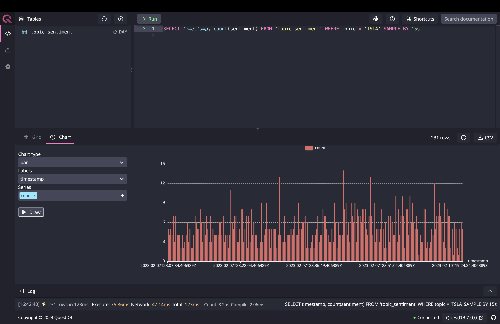

# Auspices: Realtime Tweet Sentiment Analysis
Auspices provides a simple API to track the real-time sentiment of tweets for topics you care about.

Under the hood, the project implements a tweepy [`streamingClient`](https://textblob.readthedocs.io/en/dev/) object to stream from Twitter in real time, analyzes their sentiment using the python [`TextBlob`](https://textblob.readthedocs.io/en/dev/) library, and stores the data inside a [QuestDB](https://questdb.io) table.

## Getting Started
These instructions will get you a copy of the project up and running on your local machine for development and testing purposes.

### Prerequisites
To run this project, you'll need the following:

- [`docker-compose`](https://docs.docker.com/compose/install/) installed on your machine
- A Twitter [developer account](https://developer.twitter.com/en) and a valid authentication Bearer Token

### Installing
Follow the instructions to get an instance of the Twitter Sentiment Analysis app up and running:

1. Clone this repository:
```
git clone https://github.com/giovannialberto/twitter-sentiment-analysis.git
```

2. Update the .env file in the root of the project and set the following environment variables:
```
BEARER_TOKEN=your-twitter-bearer-token
SECRET_KEY=flask-app-secret-key
```

> **Note**
> you can use any value you like for the flask `SECRET_KEY` so long as you keep it secret.

3. Start the service with `docker-compose` from the root of the project directory:

```
docker-compose up --build --detach
```

## Usage
The app exposes the following set of endpoints:

- `/start`: starts the streaming client
- `/track/<topic>`: lets you specify the topic(s) you want to keep track of
- `/stop`: stops the streaming client
- `/status`: returns the current status of the stream (running or stopped)
- `/untrack/<topic>`: lets you specify the topic(s) you want to stop tracking

You can use any HTTP client (e.g. Postman) to call these endpoints.

### Examples
With the app up and running, run the following to start the streaming client in the background:

```
curl http://localhost:5000/start
```

Now if you don't have any topics tracked yet, you will not receive any tweet from the streaming client.

In order to track of a new topic, you need to add a new rule from the `/track` endpoint. For example, to keep track of tweets mentioning $TSLA stock:

```
curl http://localhost:5000/track/$TSLA
```

You can watch all your rules from the `/rules` endpoint:

```
curl http://localhost:5000/rules
```

If you want to stop tracking tweets about the Tesla stock, you can use the `/untrack` endpoint for that:

```
curl http://localhost:5000/untrack/$TSLA
```

### Visualizing results in QuestDB
You can use the very useful QuestDB console to visualize the data collected by the stream. By default, the DB web console if exposed on port 9000 of the `localhost`.

For example, to get a breakdown of the number of tweets mentioning the Tesla stock every 15 seconds, you can run the following SQL statement from the web console:

```
SELECT timestamp, count(sentiment) FROM 'topic_sentiment' WHERE topic = '$TSLA' SAMPLE by 15s
```



## Built With
- [Flask](https://flask.palletsprojects.com/en/2.2.x/) - A lightweight web framework for Python
- [tweepy](https://docs.tweepy.org/en/stable/index.html) - An easy-to-use Python library for accessing the Twitter API
- [TextBlob](https://textblob.readthedocs.io/en/dev/) - A Python library for processing textual data
- [QuestDB](https://questdb.io/) - A relational database for real-time applications

## License
This project is licensed under the Apache 2.0 License - see the [LICENSE](LICENSE.md) file for details.